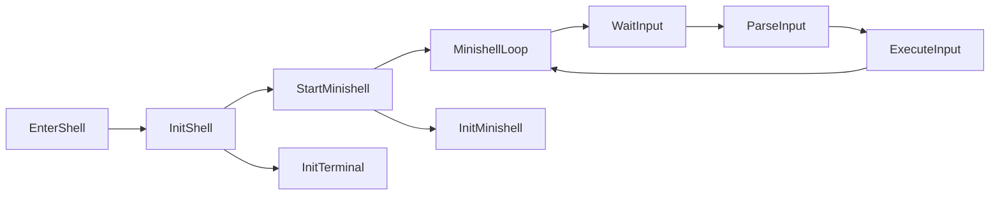

# Minishell

Minishell is a lightweight shell with some functionnalities, like:
  - Input managment
  - Redirections (**>**, **<**, **>>**, **<<**)
  - Pipes ( **|** )
  - Wildcards ( * )
  - Operators (**;** , **&&**, **||**)
  - Termcaps management
  - and other things...

---

## Usage

- Clone Repository
```bash
git clone https://github.com/vvaucoul/Minishell && cd Minishell
```

- Compilation
```bash
make
```

- Start the new shell
```bash
./minishell
```

## Shell Content

### Builtins

- **cd**
- **export**
- **echo**
- **env**
- **exit**
- **pwd**
- **unset**

### Redirections

- **>**
- **>>**
- **<**
- **<<**

### Pipes

- **Infinity of pipes.**

### Signals

- **SIGINT** [CTRL-C]
- **SIGQUIT** [CTRL-\]
- **EOF** [CTRL-D]

### Operators

- **;**
- **&&**
- **||**

### Parenthesis

- **(,)**

---

### Shell System


